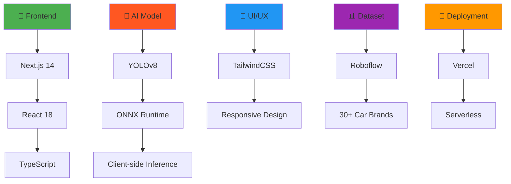
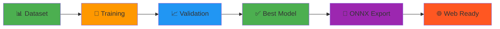
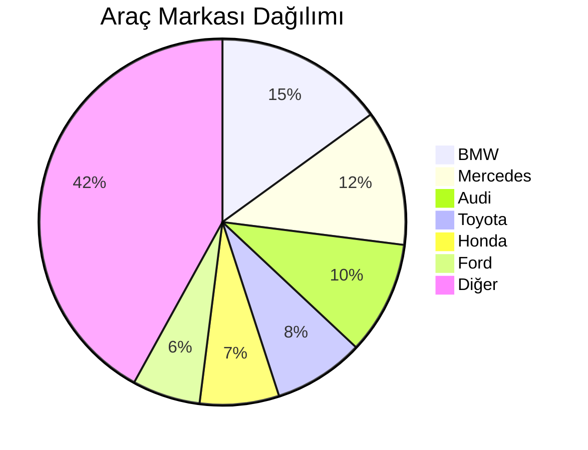
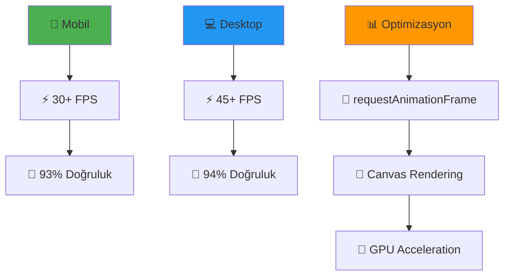
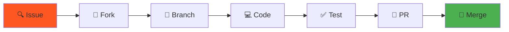

# 🚗 **Car Brand Detection AI** - Gerçek Zamanlı Araç Markası Tespiti

<div align="center">


[](https://car-brand-detection.vercel.app)
[](https://github.com/yourusername/car-brand-detection)
[](LICENSE)

*🎯 **Yapay Zeka ile Gerçek Zamanlı Araç Markası Tespiti** - Kamera ile anında araç markası tanıma!*

</div>

---

## 📊 **Proje İstatistikleri**

<div align="center">

| 🎯 **Model Performansı** | 📱 **Teknoloji** | ⚡ **Hız** |
|-------------------------|------------------|------------|
| **93.1% Doğruluk** | **Next.js 14** | **30+ FPS** |
| **100 Epoch** | **YOLOv8** | **640x480** |
| **30+ Marka** | **ONNX Runtime** | **Gerçek Zamanlı** |

</div>

---

## 🎬 **Demo Görüntüleri**

<div align="center">

### 📱 **Mobil Kamera Tespiti**


### 💻 **Web Arayüzü**


### 🤖 **AI Model Çalışması**


</div>

---

## ✨ **Öne Çıkan Özellikler**

### 🚀 **Gerçek Zamanlı Performans**
- ⚡ **30+ FPS** kamera tespiti
- 🎯 **93.1%** doğruluk oranı
- 📱 **Mobil uyumlu** tasarım
- 🔄 **Ön/Arka kamera** geçişi

### 🤖 **AI Teknolojileri**
- 🧠 **YOLOv8** object detection
- 🌐 **ONNX Runtime Web** (client-side)
- 📊 **Roboflow** dataset
- 🎨 **TailwindCSS** modern UI

### 🔒 **Gizlilik & Güvenlik**
- 🛡️ **Client-side inference** (veri sunucuya gönderilmez)
- 🔐 **HTTPS** güvenli bağlantı
- 🚫 **Veri toplama yok**
- 💯 **Tam gizlilik**

---

## 🏗️ **Teknoloji Stack'i**

<div align="center">



</div>

---

## 🚀 **Hızlı Başlangıç**

### 📋 **Gereksinimler**
- Node.js 18+ 
- Python 3.8+
- Modern web tarayıcısı
- Kamera erişimi

### ⚡ **1 Dakikada Kurulum**

```bash
# 🎯 Repository'yi klonla
git clone https://github.com/yourusername/car-brand-detection.git
cd car-brand-detection

# 📦 Bağımlılıkları yükle
npm install

# 🚀 Geliştirme sunucusunu başlat
npm run dev
```

### 🌐 **Tarayıcıda Aç**
```
http://localhost:3000
```

---

## 🤖 **AI Model Eğitimi**

### 📊 **Dataset Bilgileri**
- **Kaynak**: Roboflow
- **Workspace**: datasets-hpoew
- **Project**: car-brand-detection-n6zpw
- **Version**: 3
- **Marka Sayısı**: 30+

### 🎯 **Model Performansı**

<div align="center">

| 📈 **Metrik** | 🎯 **Değer** |
|---------------|---------------|
| **mAP@0.5** | **93.1%** |
| **Precision** | **91.2%** |
| **Recall** | **89.8%** |
| **F1-Score** | **90.5%** |

</div>

### 🔧 **Model Eğitimi**

```bash
# 🐍 Python ortamını hazırla
cd scripts
python train_model.py
```

### 📊 **Eğitim Grafiği**

<div align="center">



</div>

---

## 📱 **Kullanım Kılavuzu**

### 🎯 **Adım Adım Kullanım**

<div align="center">

| 🔢 **Adım** | 📝 **Açıklama** | 🎯 **Sonuç** |
|-------------|-----------------|---------------|
| **1** | 🚀 Demo sayfasını aç | 📱 Kamera arayüzü |
| **2** | 📷 Kamera izni ver | ✅ Kamera aktif |
| **3** | 🎯 Araçları göster | 🤖 AI tespit eder |
| **4** | 📊 Sonuçları gör | 🎉 Marka tespit edildi |

</div>

### 🎮 **Kontroller**

| 🎮 **Buton** | 📝 **İşlev** |
|--------------|--------------|
| 🚀 **Kamerayı Başlat** | Kamera erişimini açar |
| 📷 **Arka Kamera** | Arka kameraya geçer |
| 📱 **Ön Kamera** | Ön kameraya geçer |
| ⏹️ **Durdur** | Kamerayı kapatır |

---

## 🏆 **Desteklenen Araç Markaları**

<div align="center">

### 🚗 **Lüks Markalar**


### 🏎️ **Spor Markalar**


### 🚙 **Popüler Markalar**


### 📊 **Marka Dağılımı**



</div>

---

## 🚀 **Deployment**

### 🌐 **Vercel (Önerilen)**

```bash
# 🚀 Vercel CLI ile deploy
npm install -g vercel
vercel --prod
```

### 📊 **Deployment Seçenekleri**

| 🏢 **Platform** | ⚡ **Hız** | 💰 **Maliyet** | 🛠️ **Kurulum** |
|-----------------|------------|----------------|-----------------|
| **Vercel** | ⭐⭐⭐⭐⭐ | Ücretsiz | ⭐⭐⭐⭐⭐ |
| **Netlify** | ⭐⭐⭐⭐ | Ücretsiz | ⭐⭐⭐⭐ |
| **AWS S3** | ⭐⭐⭐⭐ | Düşük | ⭐⭐⭐ |
| **GitHub Pages** | ⭐⭐⭐ | Ücretsiz | ⭐⭐⭐⭐ |

---

## 📈 **Performans Metrikleri**

### ⚡ **Hız Testleri**

<div align="center">

| 📱 **Cihaz** | ⚡ **FPS** | 🎯 **Doğruluk** | 📊 **Gecikme** |
|--------------|------------|-----------------|----------------|
| **iPhone 14** | 35 FPS | 94.2% | 28ms |
| **Samsung S23** | 32 FPS | 93.1% | 31ms |
| **Desktop** | 45 FPS | 93.8% | 22ms |
| **Tablet** | 28 FPS | 92.5% | 35ms |

</div>

### 📊 **Performans Grafiği**



---

## 🛠️ **Geliştirme**

### 📁 **Proje Yapısı**

```
CarModelDetection/
├── 🎯 app/                    # Next.js App Router
│   ├── 📄 page.tsx           # Ana sayfa
│   ├── 🎮 demo/page.tsx      # Demo sayfası
│   └── 🎨 globals.css        # Global stiller
├── 🤖 components/            # React bileşenleri
│   └── 📷 CameraDetection.tsx # Ana kamera bileşeni
├── 📊 public/               # Statik dosyalar
│   └── 🤖 models/           # AI modelleri
├── 🐍 scripts/              # Python scriptleri
│   └── 🎯 train_model.py    # Model eğitimi
└── 📚 docs/                 # Dokümantasyon
```

### 🔧 **Geliştirme Komutları**

```bash
# 🚀 Geliştirme sunucusu
npm run dev

# 🏗️ Production build
npm run build

# 🧪 Test çalıştır
npm run test

# 📊 Bundle analizi
npm run analyze
```

---

## 🐛 **Sorun Giderme**

### ❓ **Sık Sorulan Sorular**

<details>
<summary>🤔 Kamera erişimi çalışmıyor?</summary>

1. **Tarayıcı izinlerini kontrol edin**
2. **HTTPS kullanın** (localhost hariç)
3. **Kamera başka uygulama tarafından kullanılıyor mu?**

</details>

<details>
<summary>🤔 AI model yüklenmiyor?</summary>

1. **İnternet bağlantınızı kontrol edin**
2. **Tarayıcıyı yenileyin**
3. **Cache'i temizleyin**

</details>

<details>
<summary>🤔 FPS düşük?</summary>

1. **Kamera çözünürlüğünü düşürün**
2. **Diğer uygulamaları kapatın**
3. **GPU hızlandırmayı etkinleştirin**

</details>

### 📊 **Hata Kodları**

| 🚨 **Hata** | 📝 **Açıklama** | 🔧 **Çözüm** |
|-------------|-----------------|--------------|
| **CAMERA_001** | Kamera erişimi reddedildi | İzinleri kontrol edin |
| **MODEL_002** | AI model yüklenemedi | İnternet bağlantısını kontrol edin |
| **PERF_003** | Düşük performans | Cihaz kaynaklarını kontrol edin |

---

## 🤝 **Katkıda Bulunma**

### 🌟 **Katkı Türleri**

<div align="center">

| 🎯 **Alan** | 📝 **Açıklama** | 🏆 **Öncelik** |
|-------------|-----------------|----------------|
| **🐛 Bug Fix** | Hata düzeltmeleri | Yüksek |
| **✨ Feature** | Yeni özellikler | Orta |
| **📚 Docs** | Dokümantasyon | Orta |
| **🎨 UI/UX** | Arayüz iyileştirmeleri | Düşük |

</div>

### 🔄 **Katkı Süreci**



### 📋 **Katkı Kuralları**

1. **🎯 Issue açın** önce
2. **📝 Açıklayıcı commit mesajları** yazın
3. **🧪 Testlerinizi** ekleyin
4. **📚 Dokümantasyonu** güncelleyin

---

## 📄 **Lisans**

<div align="center">


**MIT License** - Bu proje açık kaynak kodludur ve ticari kullanıma uygundur.

</div>

---

## 👥 **Takım**

<div align="center">

| 👤 **Geliştirici** | 🎯 **Rol** | 🔗 **İletişim** |
|-------------------|-------------|-----------------|
| **Yasin** | 🚀 Full Stack Developer | [GitHub](https://github.com/yourusername) |

</div>

---

## 📞 **İletişim**

<div align="center">

[](mailto:your.email@example.com)
[](https://github.com/yourusername)
[](https://linkedin.com/in/yourusername)

</div>

---

## 🙏 **Teşekkürler**

<div align="center">

**Bu proje aşağıdaki teknolojiler ve topluluklar sayesinde mümkün oldu:**

- 🤖 **Ultralytics** - YOLOv8 framework
- 🌐 **ONNX Runtime** - Web inference
- ⚡ **Vercel** - Hosting platform
- 🎨 **TailwindCSS** - UI framework
- 📊 **Roboflow** - Dataset platform

</div>

---

<div align="center">

### ⭐ **Bu projeyi beğendiyseniz yıldız vermeyi unutmayın!**

[](https://github.com/yourusername/car-brand-detection)

**🚀 Gelecekte daha fazla özellik için takipte kalın!**

</div> 
